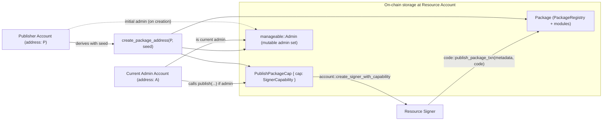

# Resource Account Code Deployment

Deterministic deployment and upgrade of Move packages to resource ("package") accounts using a publisher-provided seed. This package provides a lightweight alternative to object-based deployment by relying on Aptos resource accounts and an admin model.

Module: `ra_code_deployment::ra_code_deployment`

## Overview

- Compute a deterministic package account address from `(publisher, seed)` using a domain-separated seed.
- Lazily initialize the package account and store a capability for future upgrades.
- Publish or upgrade a package under that account with admin authorization.
- Optionally freeze management by removing admin and the stored capability.

This package does not emit events.

## Concepts

- Deterministic address (domain-separated): `create_package_address(publisher, seed)`
  - Domain separation: `BCS(@ra_code_deployment) || "::ra_code_deployment::" || seed`
- Admin model: Uses `aptos_extensions::manageable` to gate publish/upgrade to admins.
- Capability storage: `PublishPackageCap` (stored under the package account) holds the `SignerCapability` needed to sign upgrades.

## Public API

- `#[view] create_package_address(publisher: address, seed: vector<u8>): address`
  - Returns the deterministic package account address derived from `(publisher, seed)` with domain separation.
  - Pure/view helper; does not write state.

- `entry fun create_package_account(publisher: &signer, seed: vector<u8>)`
  - Creates the package account derived from `(publisher, seed)`; aborts if it already exists.
  - Stores `PublishPackageCap` and initializes manageable admin with `publisher` as admin.

- `entry fun deploy(publisher: &signer, seed: vector<u8>, metadata_serialized: vector<u8>, code: vector<vector<u8>>) acquires PublishPackageCap`
  - Ensures the package account exists (calls `create_package_account` if missing), then publishes the package to that account (equivalent to upgrade if already published).

- `entry fun publish(admin: &signer, metadata_serialized: vector<u8>, code: vector<vector<u8>>, resource_address: address) acquires PublishPackageCap`
  - Requires `admin` to be a manageable admin for `resource_address`.
  - Uses `PublishPackageCap` to create the resource account signer and calls `code::publish_package_txn` to publish/upgrade.

- `entry fun freeze_package_account(admin: &signer, resource_address: address) acquires PublishPackageCap`
  - Requires admin.
  - Revokes management by destroying the manageable resource and removes `PublishPackageCap`, preventing further publishes/upgrades via this module.

## Storage

Under the package account address:
- `PublishPackageCap { cap: SignerCapability }`
- Manageable admin resource (via `aptos_extensions::manageable`)

## Account Relationships

Note: A may equal P. If admin changes away from P, `deploy(publisher, ...)` will fail the admin check at publish time; the current admin must call `publish(admin, ..., resource_address)`.

## Notes

- Most functions are `entry` and can be called directly in a transaction. `create_package_address` is a `#[view]` helper.
- Seeds are domain-separated internally to avoid collisions with other modules; pass your desired seed bytes and the module will apply its prefixing.
- This package does not emit events. If you need indexer signals for publishes/upgrades, consider adding events in a fork or using an object-based deployment package that emits events.
